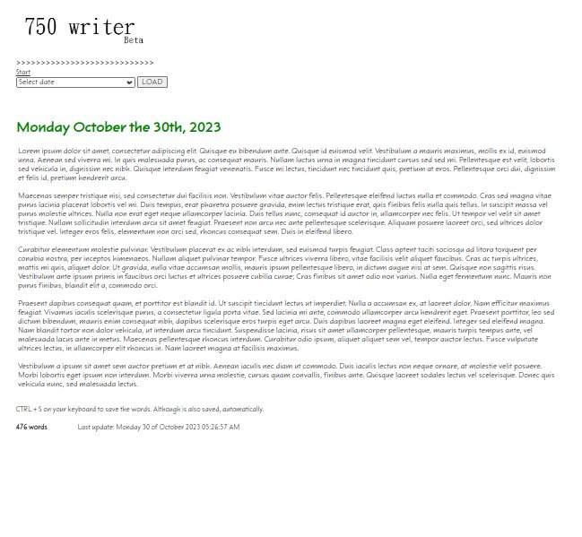

# WordCraft360 📝

#### The Ultimate Writing Toolkit

Welcome to WordCraft360, the ultimate Writing Toolkit designed to elevate your writing experience to new heights. Inspired by the minimalist elegance of 750words.com, WordCraft360 offers a sleek and visually appealing interface with carefully selected fonts that are easy on the eyes. 

WordCraft360 is not just a writing tool; it's a dynamic platform designed to nurture creativity, encourage creatitvy daily, for developers, and inspire growth. Whether you're a seasoned wordsmith or a novice writer, WordCraft360 is for ypu. ✨🖋️

#### Screenshots

#### Features 🚀:

Real-time Word Count 📈
Watch your ideas come to life as WordCraft360 counts every word you type in real-time. Stay on top of your progress and effortlessly track your writing achievements. 🚀💡

- Seamless MySQL Database Integration 🗄️
Save your precious compositions securely in the cloud with WordCraft360's seamless MySQL database integration. Your work will always be safely backed up, allowing you to access at any time. 💾🌐

- Effortless Editing and Deletion ✏️🗑️
No need to worry about mistakes! With WordCraft360, you can easily edit and delete entries to refine your prose and perfect your literary masterpieces. 🎨✨

- Insightful Date Associations 📅
Every piece of writing has a story behind it, and WordCraft360 helps you remember those moments. The platform automatically timestamps your entries, allowing you to revisit and reflect on your creative journey. 🗓️📚

- Minimalist Interface 🎯
Distraction-free writing is the key to unleashing your creativity. WordCraft360 boasts a minimalist interface that keeps you focused on your craft, removing any unnecessary clutter. 🧘‍♀️💆‍♂️

- Selective Font Perfection 🖌️🎨
I understand that font aesthetics are crucial to your writing environment. WordCraft360's font selection mirrors the elegance of its inspiration, providing a visually pleasing canvas for your words. 🖼️📜

Experience the writing revolution with WordCraft360. Unleash your creativity, stay organized, and enjoy the art of writing with a tool designed exclusively for writers/developers. 🌟🚀

#### 👨‍💻 Author

WordCraft360 is crafted with passion by Felipe Alfonso Gonzalez, a Computer Science Engineer.

📧 Contact: f.alfonso@res-ear.ch

